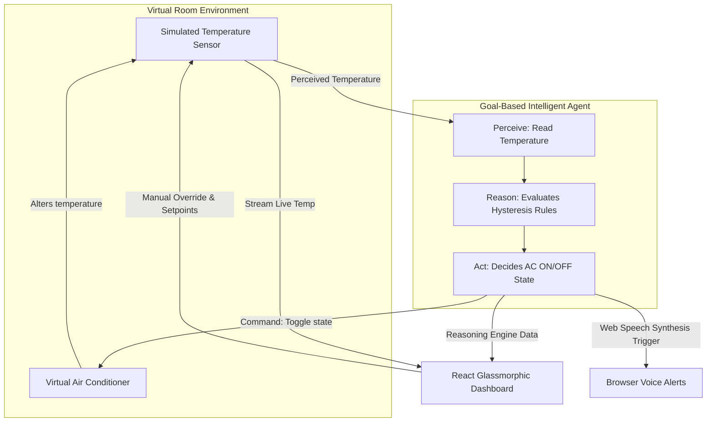

# Smart Home Temperature Control Agent
### B.Tech Agentic AI Laboratory Experiment Manual & Project Dashboard

A complete, runnable, full-stack demonstration of a **Goal-Based Intelligent Agent** utilizing a **Thermostatic Hysteresis (Deadband) Control Model** in a simulated environment. The system models a virtual temperature sensor, evaluates states against dynamic, user-configurable comfort ranges, reasons to prevent AC short-cycling, and announces transitions using browser Text-to-Speech synthesis.

---

## 🏗️ Project Architecture & Design (Hysteresis Model)

This project demonstrates an **Intelligent Agent Loop** (Perceive $\rightarrow$ Reason $\rightarrow$ Act) that incorporates **Hysteresis Control** to protect the virtual AC compressor from rapid toggling:



### Hysteresis Rules & Decision Logic
1. **User Configuration**: The user sets the comfort boundaries $[T_{\text{min}}, T_{\text{max}}]$ directly from the dashboard (default is $22^\circ\text{C} - 26^\circ\text{C}$).
2. **Comfort Setpoint**: The target midpoint is automatically calculated:
   $$T_{\text{setpoint}} = \frac{T_{\text{min}} + T_{\text{max}}}{2}$$
3. **Control Transitions**:
   - **AC is OFF**: The room temperature gradually warms up due to ambient drift. The AC remains **OFF** until the temperature rises above the maximum limit:
     $$\text{If } T > T_{\text{max}} \rightarrow \text{Turn AC ON}$$
   - **AC is ON**: The AC cools the room. Under standard threshold logic, the AC would turn off as soon as the temperature entered the comfort zone ($< 26^\circ\text{C}$), leading to rapid on/off switching (short-cycling). Under this **Hysteresis Model**, the AC stays **ON** and continues cooling until the temperature drops below the comfortable midpoint setpoint:
     $$\text{If } T \le T_{\text{setpoint}} \rightarrow \text{Turn AC OFF}$$
     This creates a wider temperature cycle, protecting electrical components and running longer, more efficient cycles.

---

## 📁 Folder Structure

```
smart-home-agent/
│
├── backend/
│   ├── main.py            # FastAPI App, CORS, and REST endpoints (including /api/target-range)
│   ├── agent.py           # Goal-Based Agent class (Hysteresis and Setpoint evaluation)
│   ├── simulator.py       # Thread-safe Virtual Temperature Sensor and range configuration
│   └── requirements.txt   # Python package dependencies
│
├── frontend/
│   ├── package.json       # React dependencies (Recharts, Bootstrap 5, Lucide Icons)
│   ├── vite.config.js     # Scaffolding configuration
│   ├── index.html         # Application viewport container
│   └── src/
│       ├── main.jsx       # Global application bootsrapper & styles entry
│       ├── App.jsx        # Dashboard layout, API synchronization, Voice alert triggers
│       ├── App.css        # Glassmorphism dark-theme styling and fan animations
│       └── index.css      # Normalization styles
│       └── components/
│           ├── DashboardCard.jsx    # Styled glassmorphic container card
│           ├── TempGauge.jsx        # SVG radial temperature dial and status fan
│           ├── TempChart.jsx        # Recharts real-time graph component
│           ├── AgentReasoning.jsx   # Terminal console visualizer for AI cognition
│           └── ActivityLog.jsx      # Historical log items with timestamps
│
├── README.md              # Detailed laboratory guide (this file)
└── requirements.txt       # Copy of backend dependencies for root installation
```

---

## 🚀 Getting Started (Installation & Running)

### Prerequisites
- Python 3.10+ installed
- Node.js v18+ and NPM installed

---

### Step 1: Run the FastAPI Backend Server

1. Open a terminal and navigate to the project backend directory:
   ```bash
   cd backend
   ```
2. Install dependencies:
   ```bash
   pip install -r requirements.txt
   ```
3. Run the uvicorn development server:
   ```bash
   uvicorn main:app --reload --port 8000
   ```
   *The backend services will start running at `http://127.0.0.1:8000`.*

---

### Step 2: Run the React Frontend Dashboard

1. Open a second terminal and navigate to the project frontend directory:
   ```bash
   cd frontend
   ```
2. Install package dependencies:
   ```bash
   npm install
   ```
3. Launch the Vite development server:
   ```bash
   npm run dev
   ```
   *The React UI will launch at `http://localhost:5173`.*

---

## 🧪 Laboratory Experiment Evaluation Checklist

When evaluating this experiment, students should demonstrate the following to their lab instructor:

1. **Host Connection Status**:
   - Check the **HOST status pill** in the top right. It should display a green `CONNECTED`.
2. **Demonstrate Hysteresis Cycle**:
   - Set the comfort range to $22^\circ\text{C} - 26^\circ\text{C}$ (midpoint setpoint = $24^\circ\text{C}$) and click **Start Drift**.
   - Watch the temperature rise past $26^\circ\text{C}$ and verify the AC turns **ON**.
   - As it cools down, verify that the AC remains **ON** through $25.5^\circ\text{C}$ and $24.5^\circ\text{C}$, and only turns **OFF** when the temperature drops to or below the comfortable midpoint setpoint ($24.0^\circ\text{C}$).
3. **Dynamic Goal Adjustments**:
   - Click the **+** and **-** buttons under **Agent Comfort Range Goals** to change the boundaries (e.g., Min Limit = $20^\circ\text{C}$, Max Limit = $25^\circ\text{C}$).
   - Verify that the target setpoint updates in real-time, the shaded green comfort zone on the history graph shifts automatically, and the agent adapts its decision parameters instantly.
4. **Text-to-Speech Integration**:
   - Confirm that the browser announces changes in the AC status verbally, but only when a state change occurs, preventing repetitive noise.
5. **Cognitive Audit**:
   - Review the **Cognitive Reasoning** panel and verify that the agent's logic outputs match the current temperature and selected setpoint rules.
